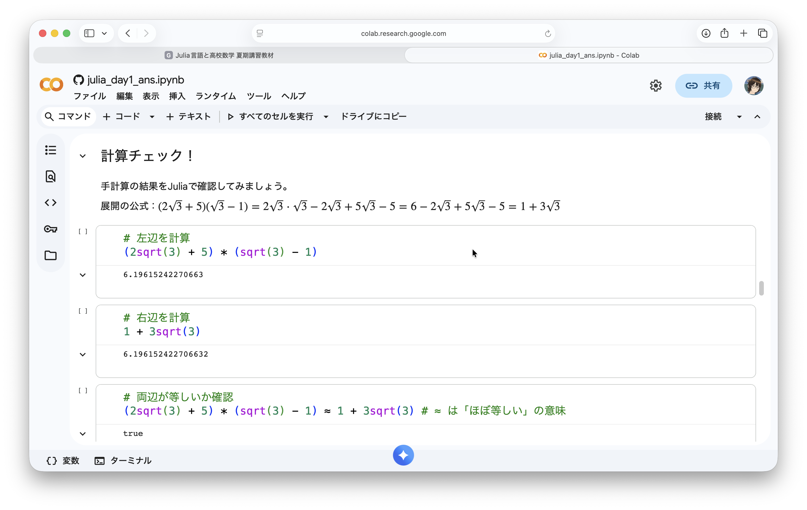
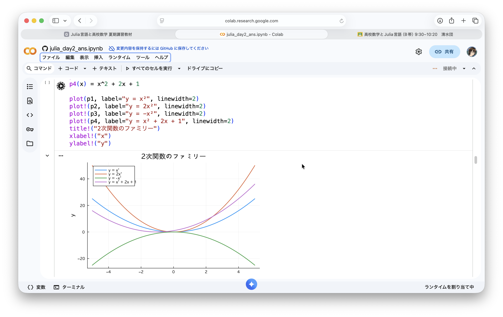
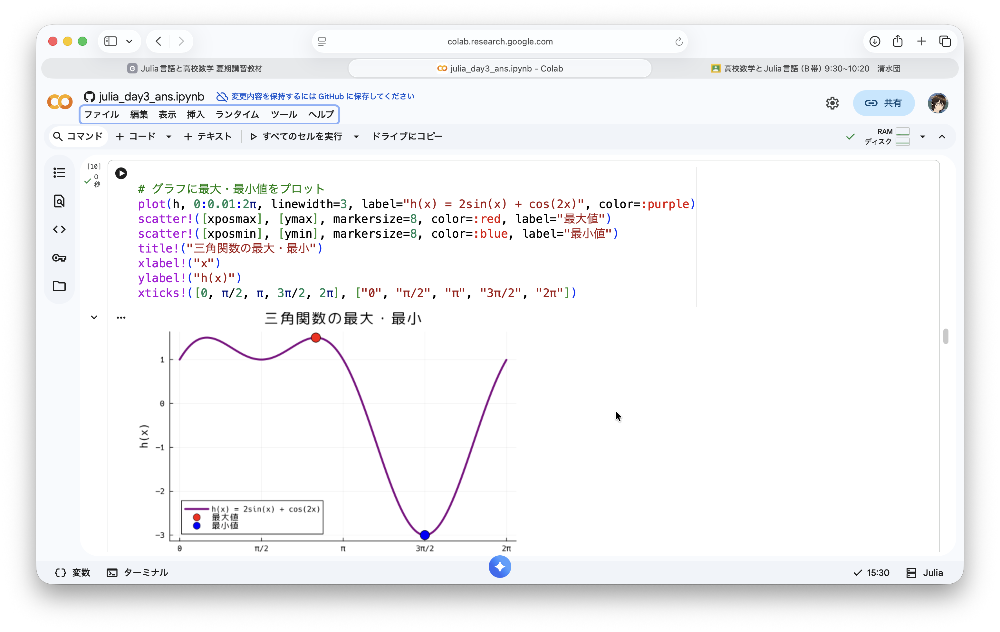
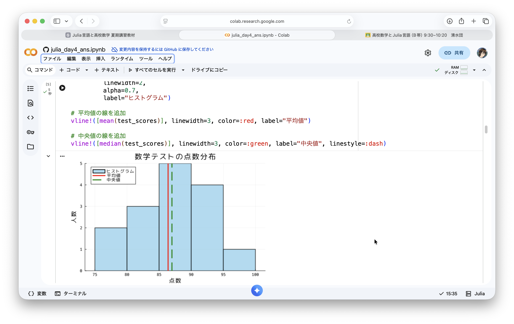
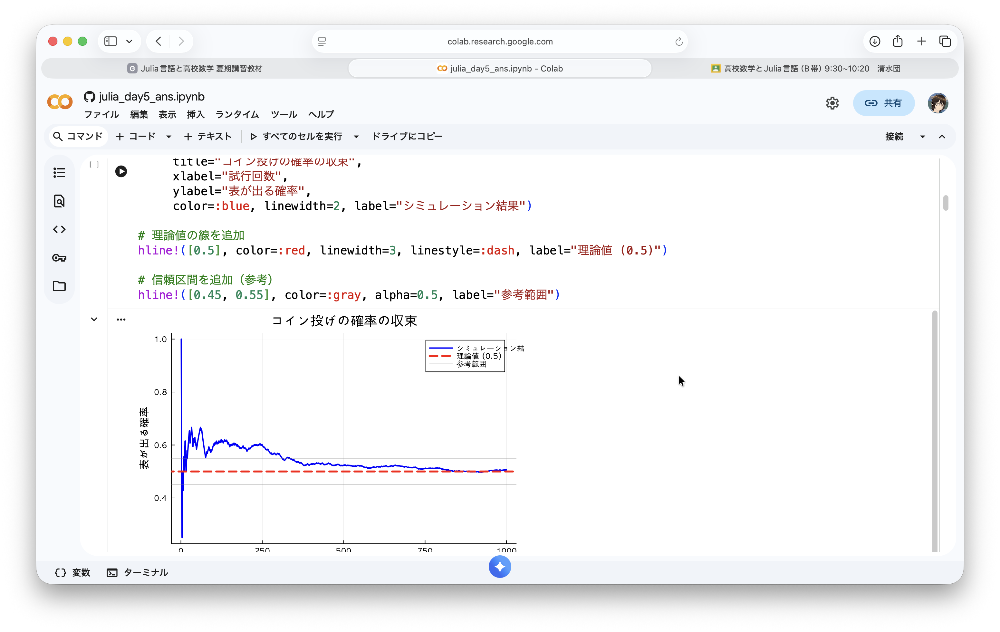
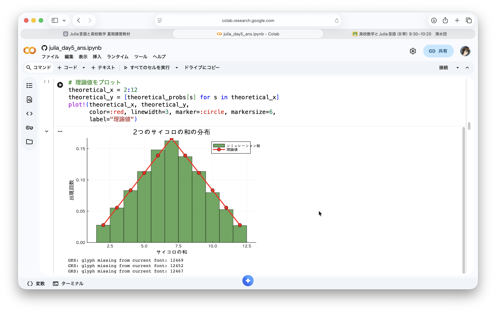
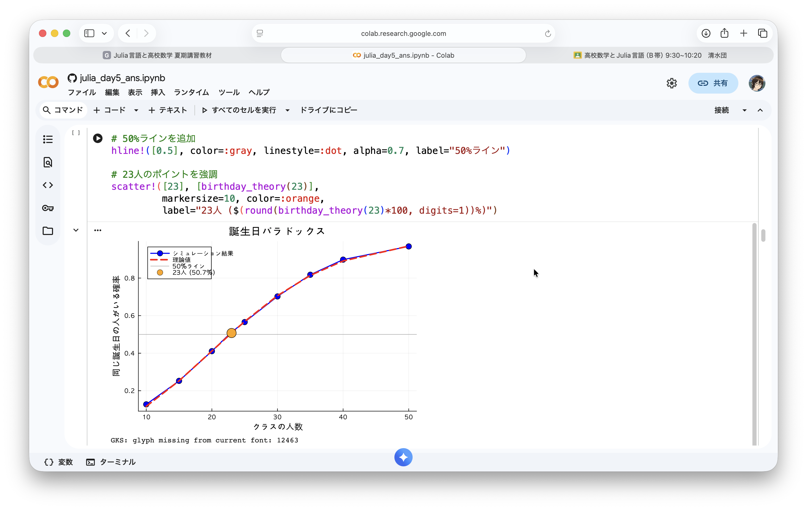

# 高校数学とJulia言語

## 5日間の夏期講習会のレポート

城北中学校・高等学校　清水団
2026年2月16日
理数系教科研究会
令和７年度「合同授業実践報告会」

---


## 自己紹介

**清水団（しみず だん）**
城北中学校・高等学校（東京都板橋区）
数学科教諭・校長

### 経歴・活動
- Julia言語との出会い：2018年頃〜
- コーディングを用いた数学学習に関心
- Mac，Julia，Typstなどを好んで使用

---

## なぜJulia言語なのか

**1. 数学的記法の親和性**
```julia
# 数学の式をほぼそのまま書ける
f(x) = 2x + 3
g(x) = f(sin(x))/2π
```

**2. 高速な数値計算**
- 複雑な計算も瞬時に実行、グラフ描画もシンプル

**3. 豊富な数学ライブラリ**
- 統計、最適化、線形代数、組み合わせ・素数など

---

## 転機：Google Colab対応（2025年3月）

<div class="success">

### 2025年3月6日　Google ColabがJulia言語に正式対応！

</div>

<div class="three-column">

<div>

**環境構築不要**
- インストール不要
- ブラウザだけで実行可能

</div>

<div>

**デバイスを選ばない**
- PCだけでなくiPadでも利用可能

</div>

<div>

**Classroomとの連携**
- 課題の配布・回収がスムーズ

</div>

</div>

---

## 講習の実施概要

<div class="stats-box">

**参加生徒数：約80名**（中学3年生・高校1年生）

</div>

**実施期間** 2025年8月24日（日）〜 8月28日（木）の5日間

**実施形式**
- 会場：講堂　／　時間：午前中50分×2コマ制
- 形式：ハンズオン形式（生徒各自のPC/タブレット）
- 使用ツール：Google Colab（Julia）+ Google Classroom

---

## 5日間のカリキュラム構成

各日、解説PDF（スライド）とコンテンツ（.ipynbファイル）をGoogleクラスルームに配置し、簡単な解説の後、生徒はワーク（演習）に取り組む形式

### Day 1：Google Colabの紹介とJulia言語で計算してみよう
### Day 2：関数を定義してグラフを描こう
### Day 3：関数の最大・最小を求めよう
### Day 4：データの可視化と統計処理
### Day 5：確率とシミュレーション

---

## Day 1：計算の検証

**問題**：$(2\sqrt{3}+5)(\sqrt{3}-1)$ を計算せよ

```julia
# 左辺をそのまま計算
left = (2sqrt(3) + 5) * (sqrt(3) - 1)

# 展開した右辺を計算
right = 1 + 3sqrt(3)

# 等しいか確認
left ≈ right  # → true
```

- まず手計算→Juliaで検証→間違いがあれば考え直す
- 「カンニングツール」ではなく「理解を深めるツール」

---



---

## Day 2：関数とグラフ描画

```julia
# 関数定義
f(x) = x^2 - 4x + 3

# グラフ描画（一瞬で完成）
plot(f, xlim=(-1, 5), label="f(x) = x² - 4x + 3")

# 複数のグラフを重ねる
g(x) = -x^2 + 4x + 1
plot!(g, label="g(x) = -x² + 4x + 1")
```

**従来**：1つのグラフで10分以上 → **Julia**：数秒で何十個でも比較可能

---



---

## Day 3：関数の最大・最小

```julia
# 関数定義とグラフ描画
f(x) = -x^2 + 4x + 1
plot(f, lw=3, label="f(x)")

# 数値的に最大値を探索
X = -10:0.01:10
Y = f.(X)
y_max = maximum(Y)
x_max = X[argmax(Y)]

scatter!([x_max], [y_max], ms=8, color=:red, label="最大値")
```

グラフで視覚的に理解 → 数値で検証 → 複雑な関数でも同じ手法

---



---

## Day 4：データの可視化と統計処理

```julia
# テスト結果
test_scores = [85, 92, 78, 88, 95, 82, 90, 87, 83, 91, 76, 89, 94, 80, 86]

# 統計量を一括計算
println("平均値：", mean(test_scores))
println("標準偏差：", std(test_scores))

# ヒストグラムで分布を可視化
histogram(test_scores, bins=5, title="点数分布", alpha=0.7)
vline!([mean(test_scores)], lw=3, color=:red, label="平均値")
```

データ全体の分布を視覚的に把握、大量のデータでも瞬時に処理

---



---

## Day 5：確率とシミュレーション

**大数の法則を体験**
```julia
function simulate_coin_flips(n)
    heads_count = sum([rand() < 0.5 for _ in 1:n])
    return heads_count / n
end

# 結果例
# 10回: 確率 = 0.4000
# 1000回: 確率 = 0.5010
# 100000回: 確率 = 0.5001
```

試行回数が増えると理論値に収束する様子を体験！

---



---




---



---


## まとめ：コードで広がる数学の可能性

<div class="comparison">

<div>

**従来の数学教育**
- 紙と鉛筆での計算が中心
- 限られた例題のみ扱える
- 理論先行で抽象的

</div>

<div>

**Julia言語を使った数学学習**
- 視覚化と実験で概念を具体的に理解
- 大量のデータや複雑な問題にも挑戦可能
- 試行錯誤を通じて自分で発見する学び

</div>

</div>

<div class="highlight">

プログラミングは「ツール」ではなく「思考の拡張」。数学が「自由」になる！

</div>

---

## 今回のコースウェア

### すべての教材をオープンに公開

**📚 Julia言語と高校数学　夏期講習コース**
https://shimizudan.github.io/julia-summer-course/

- すべてのスライド（PDF）
- Jupyter Notebook形式の演習ファイル（.ipynb）
- Google Colabで直接開いて実行可能

どなたでも自由にご利用いただけます。
