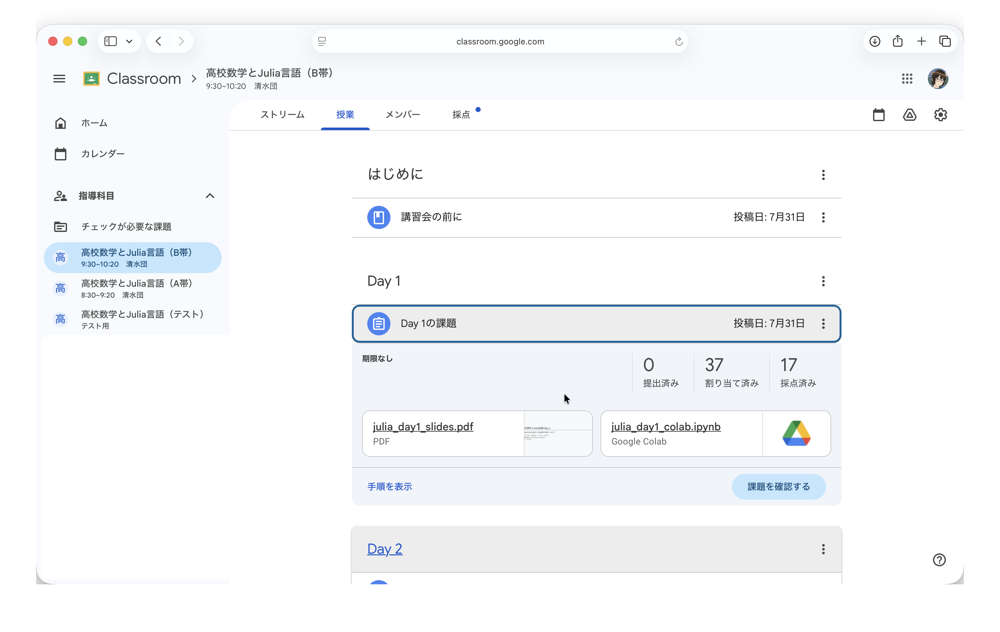
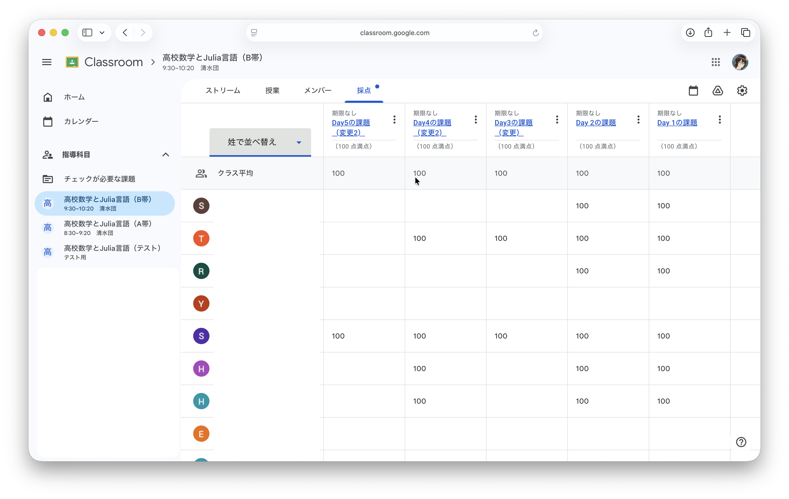
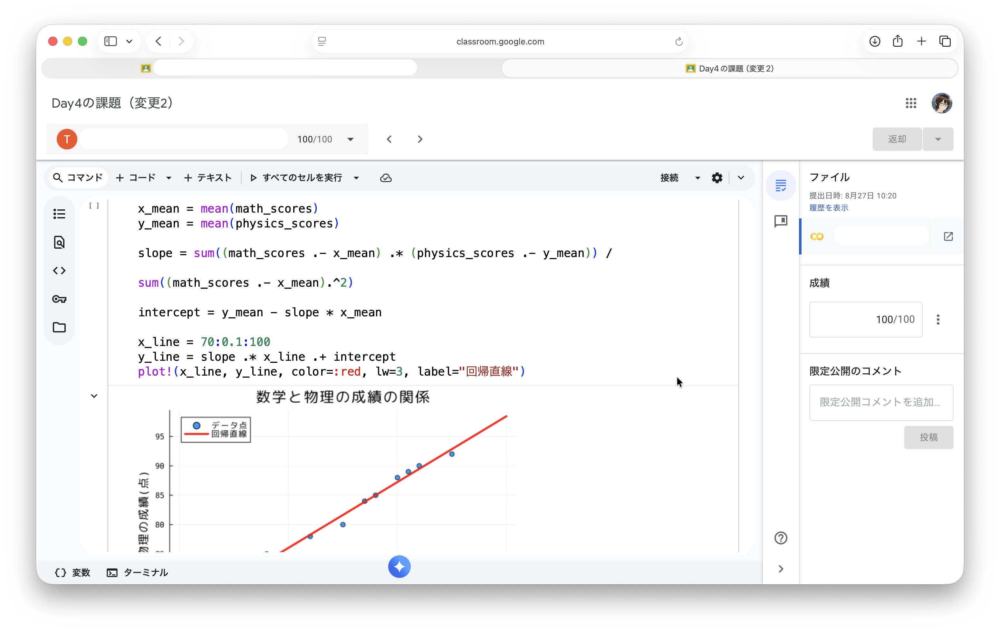
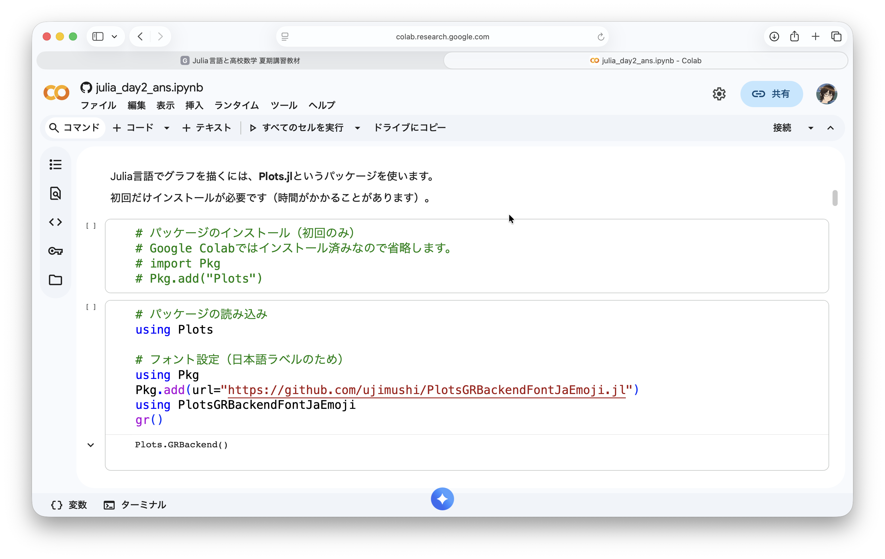
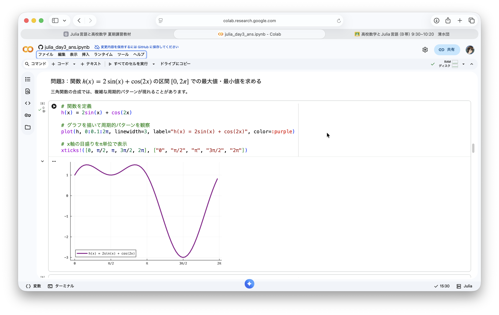
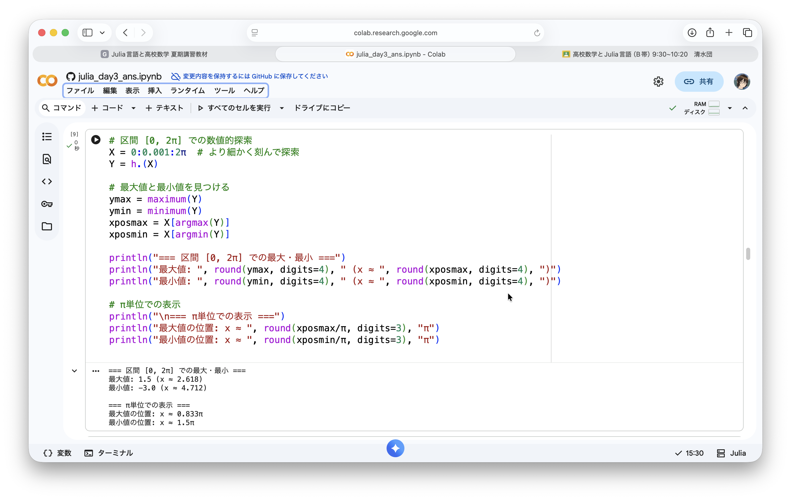
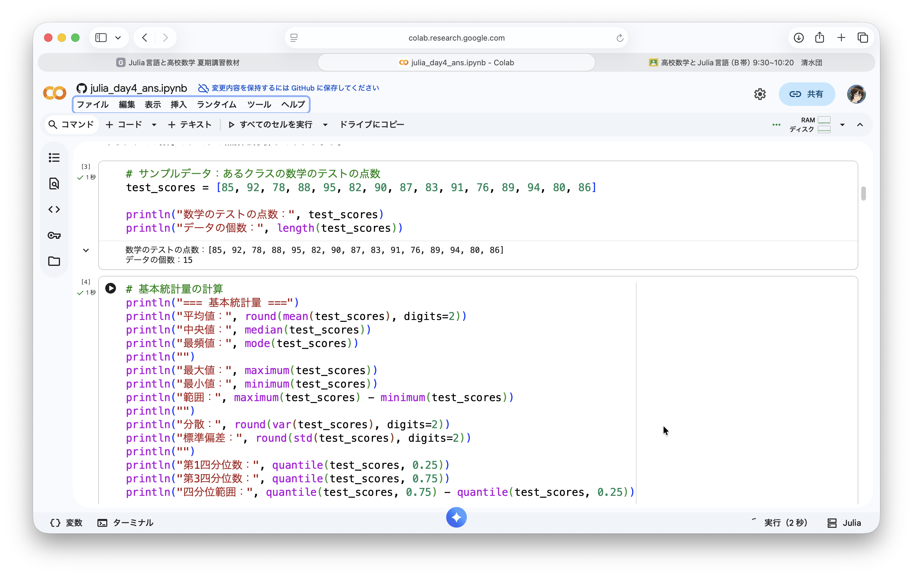
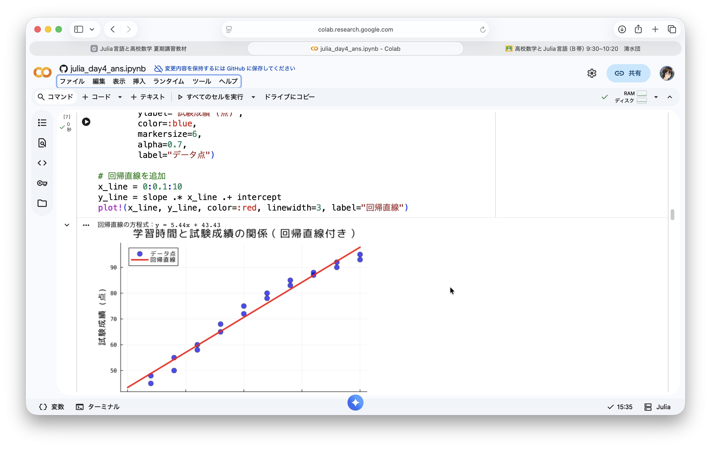
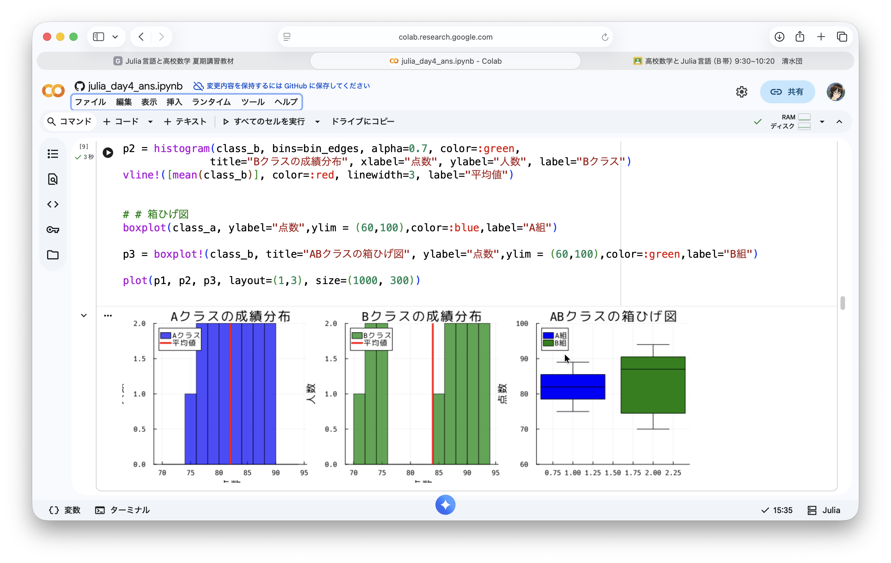
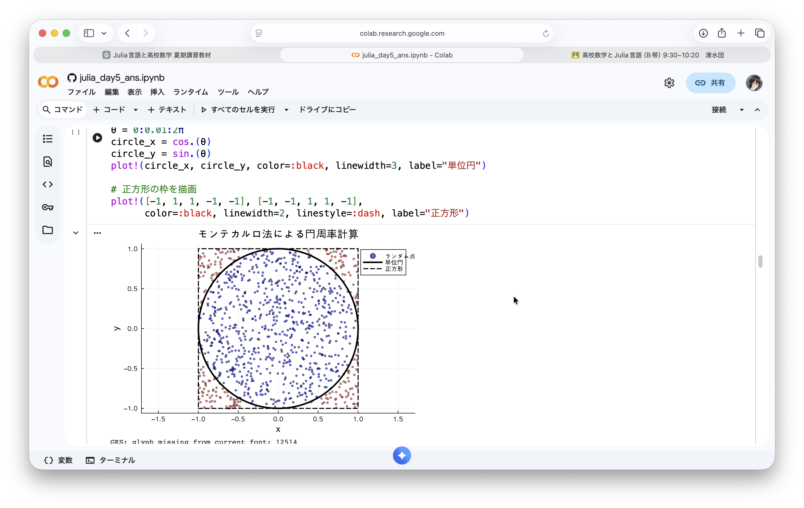

# Julia言語と高校数学

## 5日間の夏期講習会のレポート

城北中学校・高等学校　清水団
2025年12月13日
JuliaLang Japan 2025

---


## 自己紹介

**清水団（しみず だん）**
城北中学校・高等学校（東京都板橋区）
数学科教諭・校長

### 経歴・活動
- 城北中学校・高等学校に勤務
- Julia言語との出会い：2018年頃〜
- コーディングを用いた数学学習支援に関心があります
- Mac，Julia，Typstなどを好んで使ってます


---

## Julia言語との関わり

### これまでの発信活動

**発表など**
- Julia Tokai #22（2025/6/22） Julia言語と高校数学
  https://colab.research.google.com/github/shimizudan/20250622julia-tokai/blob/main/20250622.ipynb?hl=ja

- Julia Tokai #21（2025/3/21） 大学入試とJulia言語
  https://shimizudan.github.io/20250327tokyo-u/327001.html#/title-slide

- Julia tokyo #12（2024/8/31） 高校数学とJulia
  https://shimizudan.github.io/20240831juliatokyo/


**オンラインでの発信・ブログなど**
- Zenn https://zenn.dev/dannchu
- X https://x.com/dannchu

---

## なぜJulia言語なのか

<!-- ### 高校数学教育に最適な理由 -->

**1. 数学的記法の親和性**
```julia
# 数学の式をほぼそのまま書ける
f(x) = 2x + 3
g(x) = f(sin(x))/2π
```

**2. 高速な数値計算**
- 複雑な計算も瞬時に実行
- グラフ描画もシンプルで高速

**3. 豊富な数学ライブラリ**
- 統計、最適化、線形代数など便利です。
- 組み合わせ・素数パッケージなどもよく利用します。

---

## 転機：Google Colab対応（2025年3月）

<div class="success">

### 2025年3月6日
**Google ColabがJulia言語に正式対応！**

</div>

### これにより実現できたこと

<div class="three-column">

<div>

**環境構築不要**
- PCにJuliaをインストール不要
- ブラウザだけで実行可能

</div>

<div>

**デバイスを選ばない**
- PCだけでなくiPadでも利用可能
- 生徒が自宅でも継続学習可能

</div>

<div>

**Google Classroomとの連携**
- 課題の配布・回収がスムーズ
- 生徒の進捗管理が容易

</div>

</div>

---

## 本校の教育環境

### Google Workspace for Education導入済み

**インフラ整備状況**
- 教職員・生徒全員にGoogleアカウント付与
- Google Classroomを日常的に活用
- 生徒はGoogle Workspaceに習熟

**生成AIの活用**
- 校内で生成AI利用ガイドラインを策定
- Gemini等の積極的活用を推進
- プログラミング学習でもAI活用を推奨

<div class="highlight">
Google Colab + Classroom + Gemini + 今回はJulia言語
</div>

---



---




---




---
## 今回の夏期講習会の目的・ねらい

### 主な教育目標

<div class="comparison">

<div>

**1. 数学概念の深い理解**
- 計算だけでなく視覚化で理解を促進
- 抽象的な概念を具体的に体験

**2. プログラミング的思考の習得**
- 問題解決のプロセスを体験
- 試行錯誤を通じた学び

</div>

<div>

**3. データリテラシーの向上**
- データを読み取り分析する力
- 統計的思考の基礎

**4. 自律的学習態度の育成**
- 自分で調べ、試し、修正するサイクル
- AI(Gemini)を活用した問題解決

</div>

</div>

---

## 講習の実施概要

<div class="stats-box">

**参加生徒数：約80名**
中学3年生・高校1年生

</div>

**実施期間**
2025年8月24日（日）〜 8月28日（木）の5日間

**実施形式**
- 会場：講堂
- 時間：午前中50分×2コマ制（A帯・B帯）
- 形式：ハンズオン形式
- デバイス：生徒各自のPC/タブレット（キーボード推奨）

**使用ツール**
- Google Colab（Julia）+ Google Classroom

---

## 従来の数学教育との対比

| 観点 | 従来の数学教育 | Julia×プログラミング教育 |
|:---:|:---|:---|
| **アプローチ** | **計算中心**<br>- 公式の暗記と適用<br>- 紙と鉛筆での手計算<br>- 計算ミスの多さ | **視覚化中心**<br>- 概念の理解を重視<br>- コンピュータで高速計算<br>- 本質的な思考に集中 |
| **理解の仕方** | **抽象的**<br>- グラフは教科書の図のみ<br>- データは少数の例題だけ<br>- 理論先行型 | **具体的**<br>- 自由にグラフを描画<br>- 大量のデータで実験<br>- 実験→理論の帰納的学習 |
| **学習スタイル** | **受動的**<br>- 教師の説明を聞く<br>- 問題を解く<br>- 解答を確認 | **能動的**<br>- 自分でコードを書く<br>- 試行錯誤して発見<br>- AI(Gemini)を活用 |

---

## 5日間のカリキュラム構成

**実施形式**
- 各日、解説PDF（スライド）とコンテンツ（.ipynbファイル）をGoogleクラスルームに配置
- 簡単な解説の後、生徒はワーク（演習）に取り組む
- Google Colab上でJuliaを使って実習

**5日間のテーマ**

### Day 1：Google Colabの紹介とJulia言語で計算してみよう
### Day 2：関数を定義してグラフを描こう
### Day 3：関数の最大・最小を求めよう
### Day 4：データの可視化と統計処理
### Day 5：確率とシミュレーション

---

## Day 1の詳細：Google Colabの紹介とJulia言語で計算してみよう

**学習内容**
- Google Colab環境の設定（Juliaランタイム選択）
- 基本的な四則演算
- 数学定数（π、ℯ）と数学関数
- 変数を使った計算
- Julia特有の数学的記法（`2π`、`2sqrt(3)`など）

**演習問題**
- 展開と計算の検証
- 三角関数の値の計算
- 手計算とJuliaでの計算結果の比較

---

## Day 1の詳細：従来との対比

### 従来の数学の授業での展開計算

**問題**：$(2\sqrt{3}+5)(\sqrt{3}-1)$ を計算せよ

**従来のアプローチ**
1. 分配法則を適用して展開
2. 同類項をまとめる
3. 計算ミスがないか何度も確認

**生徒の困難点**
- 計算ミスが多い
- $\sqrt{3}$の扱いが難しい
- 答えが合っているか不安

---


---

## Day 1の詳細：Juliaでの実践

**Juliaでのアプローチ**

```julia
# 左辺をそのまま計算
left = (2sqrt(3) + 5) * (sqrt(3) - 1)

# 展開した右辺を計算
right = 1 + 3sqrt(3)

# 等しいか確認
left ≈ right  # → true
```

<div class="comparison">

<div>

**生徒の学び**
- 計算結果の即座の検証
- 数学的記法の自然な表現
- 計算過程への注目（答え合わせツールではない）

</div>

<div>

**重要なポイント**
- Juliaは「カンニングツール」ではなく「理解を深めるツール」
- まず手計算→Juliaで検証→間違いがあれば考え直す

</div>

</div>

---

## Day 2：関数を定義してグラフを描こう

**学習内容**
- Julia言語での関数定義（`f(x) = 2x + 1`）
- Plots.jlパッケージの利用
- 1次関数、2次関数、三角関数のグラフ描画
- 複数のグラフを重ねて比較
- グラフの見た目のカスタマイズ

**演習問題**
- 2次関数の頂点を視覚的に確認
- 三角関数の周期を観察
- 自分で面白い関数を作ってグラフ化

---

## Day 2の詳細：従来との対比

### 従来の数学の授業でのグラフ描画

**2次関数のグラフを描く場合**
1. 頂点の座標を計算
2. いくつかの点を計算して表を作成
3. 方眼紙に点をプロット
4. なめらかな曲線で結ぶ

**生徒の困難点**
- 時間がかかる（1つのグラフで10分以上）
- 描画ミスで形が歪む
- 複数のグラフを比較するのが困難
- パラメータを変えて実験できない

---

## Day 2の詳細：Juliaでの実践

**Juliaでのアプローチ**

```julia
# 関数定義
f(x) = x^2 - 4x + 3

# グラフ描画（一瞬で完成）
plot(f, xlim=(-1, 5), label="f(x) = x² - 4x + 3")

# 複数のグラフを重ねる
g(x) = -x^2 + 4x + 1
plot!(g, label="g(x) = -x² + 4x + 1")
```


<div class="comparison">

<div>

**生徒の学び**
- パラメータを変えて瞬時に結果を確認
- グラフの形の変化のパターンを発見
- 複数の関数を簡単に比較

</div>

<div>

**重要なポイント**
- 10分 → 数秒でグラフ完成
- 1つ → 何十個でも比較可能
- 手作業の苦労 → 数学的思考に集中

</div>

</div>


---



---


---

## Day 3：関数の最大・最小を求めよう

**学習内容**
- グラフによる最大・最小の視覚的理解
- 数値的探索による最適解の発見
- 制約条件付き最適化
- 三角関数の最適化
- 理論的解法との比較

**演習問題**
- 2次関数の最小値を数値的に求める
- 3次関数の区間内での最大・最小
- 応用問題：複雑な関数の最適化

---

## Day 3の詳細：従来との対比

### 従来の数学の授業での最適化

**問題**：$f(x) = -x^2 + 4x + 1$ の最大値を求めよ

**従来のアプローチ**
1. 平方完成：$f(x) = -(x-2)^2 + 5$
2. よって最大値は $x=2$ のとき $5$

**生徒の困難点**
- 平方完成のテクニックが難しい
- 3次関数以上では高校範囲では解けない
- 理論だけで直感的理解が難しい

---

## Day 3の詳細：Juliaでの実践

**Juliaでのアプローチ**

```julia
# 関数定義とグラフ描画
f(x) = -x^2 + 4x + 1
plot(f, lw=3, label="f(x)")

# 数値的に最大値を探索
X = -10:0.01:10
Y = f.(X)
y_max = maximum(Y)
x_max = X[argmax(Y)]

println("x = $x_max のとき最大値 $y_max")

# 最大値の点をグラフに追加
scatter!([x_max], [y_max], ms=8, color=:red,label="最大値")
```

**生徒の学び**
✅ グラフで視覚的に理解→数値で検証
✅ 複雑な関数でも同じ手法で解ける
✅ 理論解と数値解の比較

---

## Day 3の詳細：新しいアプローチの価値

### 従来は解けなかった問題にも挑戦可能

**例：複雑な関数の最適化**
$$h(x) = 2\sin(x) + \cos(2x) \quad (0 \le x \le 2\pi)$$

**従来の高校数学**
- 微分を使っても計算が複雑

**Juliaでのアプローチ**
```julia
h(x) = 2sin(x) + cos(2x)
plot(h, 0:0.01:2π)  # グラフで全体像を把握

# 数値探索
X = 0:0.001:2π
x_max = X[argmax(h.(X))]
```

✅ 高度な問題にも同じ手法で対応可能
✅ 視覚的理解と数値計算の組み合わせ

---



---



---


---

## Day 4：データの可視化と統計処理

**学習内容**
- 基本統計量（平均、中央値、標準偏差）の計算
- ヒストグラムによるデータ分布の可視化
- 散布図と相関分析
- 回帰直線の導出
- 箱ひげ図による複数グループの比較

**演習問題**
- テスト成績データの統計分析
- 学習時間と成績の相関分析
- 2つのクラスの成績比較

---

## Day 4の詳細：従来との対比

### 従来の数学の授業でのデータ分析

**問題**：15人のテスト結果の平均と標準偏差を求めよ

**従来のアプローチ**
1. 電卓で15個の数値を足し算
2. 15で割って平均を計算
3. 偏差を計算して二乗
4. 分散、標準偏差を計算

**生徒の困難点**
- 計算ミスが頻発
- 時間がかかる（10分以上）
- データの「感覚」が掴めない
- グラフ化は実質不可能

---

## Day 4の詳細：Juliaでの実践

**Juliaでのアプローチ**

```julia
# テスト結果
test_scores = [85, 92, 78, 88, 95, 82, 90, 87, 83, 91, 76, 89, 94, 80, 86]

# 統計量を一括計算
println("平均値：", mean(test_scores))
println("中央値：", median(test_scores))
println("標準偏差：", std(test_scores))

# ヒストグラムで分布を可視化
histogram(test_scores, bins=5,
         title="点数分布", alpha=0.7)
vline!([mean(test_scores)], lw=3,
       color=:red, label="平均値")
```

**生徒の学び**
✅ データ全体の分布を視覚的に把握
✅ 統計量の意味を直感的に理解
✅ 大量のデータでも瞬時に処理

---



---


---

## Day 4の詳細：相関分析

### 従来は扱えなかった高度な分析

**学習時間と成績の関係を分析**

```julia
# データ
study_hours = [1, 2, 3, 4, 5, 6, 7, 8, 9, 10]
exam_scores = [45, 55, 60, 68, 75, 80, 85, 88, 92, 95]

# 相関係数
correlation = cor(study_hours, exam_scores)
println("相関係数：", correlation)  # → 0.99...

# 散布図と回帰直線
scatter(study_hours, exam_scores, label="データ")
# 回帰直線を追加...
```

**生徒の発見**
✅ データから関係性を見出す力
✅ 相関と因果の違いを考える
✅ 予測モデルの基礎を体験

✅ 高校「数学I」の「データの分析」が実践的に！

---



---



---

## Day 5：確率とシミュレーション

**学習内容**
- コイン投げシミュレーションと大数の法則
- サイコロの確率分布
- 誕生日のパラドックス
- モンテカルロ法による円周率の計算
- 確率論と実験の関係

**演習問題**
- ジャンケンの確率シミュレーション
- 3つのサイコロの最大値の確率
- モンティ・ホール問題
- ランダムウォーク

---

## Day 5の詳細：従来との対比

### 従来の数学の授業での確率

**問題**：コインを100回投げたとき、表が出る確率は？

**従来のアプローチ**
- 理論：確率は $\frac{1}{2}$ である
- 実験：実際に100回投げて確かめる（時間がかかる）
- 問題：試行回数が限られる

**生徒の理解**
- 「理論上は $\frac{1}{2}$ だけど、本当？」
- 大数の法則を体験できない
- 複雑な確率問題は実験不可能

---

## Day 5の詳細：Juliaでの実践

**シミュレーションで大数の法則を体験**

```julia
# コイン投げシミュレーション
function simulate_coin_flips(n)
    heads_count = sum([rand() < 0.5 for _ in 1:n])
    return heads_count / n
end

# 様々な試行回数で実験
for n in [10, 100, 1000, 10000, 100000]
    prob = simulate_coin_flips(n)
    println("$(n)回: 確率 = $(round(prob, digits=4))")
end

# 結果例
# 10回: 確率 = 0.4000
# 100回: 確率 = 0.4900
# 1000回: 確率 = 0.5010
# 10000回: 確率 = 0.4998
# 100000回: 確率 = 0.5001
```

✅ 試行回数が増えると理論値に収束する様子を体験！

---


---

## Day 5の詳細：誕生日のパラドックス

### 直感に反する確率現象を実験で確かめる

**問題**：30人のクラスで、同じ誕生日の人が2人以上いる確率は？

**生徒の直感**
- 「365日あるから、確率は低そう...」
- 「10%くらい？」

**理論計算**
- 複雑な計算が必要
- 高校数学の範囲でギリギリ

---

**Juliaでのシミュレーション**
```julia
function has_birthday_collision(n_people)
    birthdays = rand(1:365, n_people)
    return length(unique(birthdays)) < n_people
end

# 10000回試行
n_trials = 10000
prob = sum([has_birthday_collision(30)
           for _ in 1:n_trials]) / n_trials
println("30人で同じ誕生日: $(prob*100)%")
# → 約70%！
```

---


---

## Day 5の詳細：モンテカルロ法

### 高度な数学的手法を体験

**問題**：ランダムな点を使って円周率πを求める

**アイデア**
1. 正方形内にランダムに点を打つ
2. 円の内側に入る点の割合を数える
3. π ≈ 4 × (円内の点数) / (全体の点数)

---

```julia
function estimate_pi(n_points)
    inside_circle = 0
    for _ in 1:n_points
        x, y = rand() * 2 - 1, rand() * 2 - 1
        if x^2 + y^2 <= 1
            inside_circle += 1
        end
    end
    return 4 * inside_circle / n_points
end

estimate_pi(1000000)  # → 3.1415...
```

✅ 大学レベルの数値計算手法を高校生が体験！

---



---

## まとめ

### コードで広がる数学の可能性

<div class="highlight">

プログラミングを活用することで、数学学習のアプローチが大きく拡張されます

</div>

**従来の数学教育**
- 紙と鉛筆での計算が中心
- 限られた例題・問題のみ扱える
- 理論先行で抽象的になりがち

**Julia言語を使った数学学習**
- 視覚化と実験で概念を具体的に理解
- 大量のデータや複雑な問題にも挑戦可能
- 試行錯誤を通じて自分で発見する学び

---

## 数学が「自由」になる

### プログラミングがもたらす学びの変化

<div class="success">

**数学は暗記科目ではなく、探究する学問へ**

</div>

- **自由に実験できる**：パラメータを変えて何度でも試せる
- **自由に可視化できる**：グラフや図で直感的に理解できる
- **自由に挑戦できる**：高度な問題にも同じ手法で取り組める
- **自由に創造できる**：自分のアイデアをコードで表現できる

生徒たちは「数学＝計算の正確さ」から解放され、**数学的思考そのものを楽しむ**ようになります。

---

## 今回のコースウェア

### すべての教材をオープンに公開

今回の5日間の夏期講習で使用した教材は、以下のサイトにまとめてあります。

**📚 Julia言語と高校数学　夏期講習コース**
https://shimizudan.github.io/julia-summer-course/

- すべてのスライド（PDF）
- Jupyter Notebook形式の演習ファイル（.ipynb）
- Google Colabで直接開いて実行可能

どなたでも自由にご利用いただけます。

---

## 今後の展望

### Julia × 教育の可能性

**Google Colab対応により実現したこと**
- 環境構築不要で誰でもすぐに始められる
- デバイスを選ばず学習できる
- Google Classroomとの連携で授業運営がスムーズ

**これからの数学教育**
- プログラミングは「ツール」ではなく「思考の拡張」
- データサイエンス、AI時代に必要な力を育成
- 生徒が主体的に探究する学びへ

<div class="highlight">

Julia言語は、数学教育の未来を切り拓く強力なパートナーです

</div>
